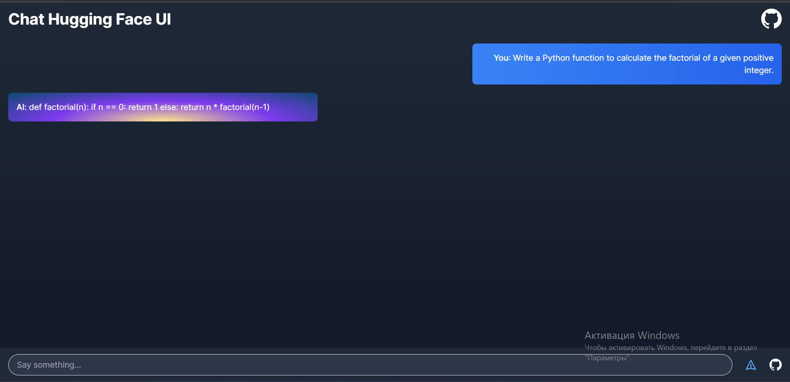
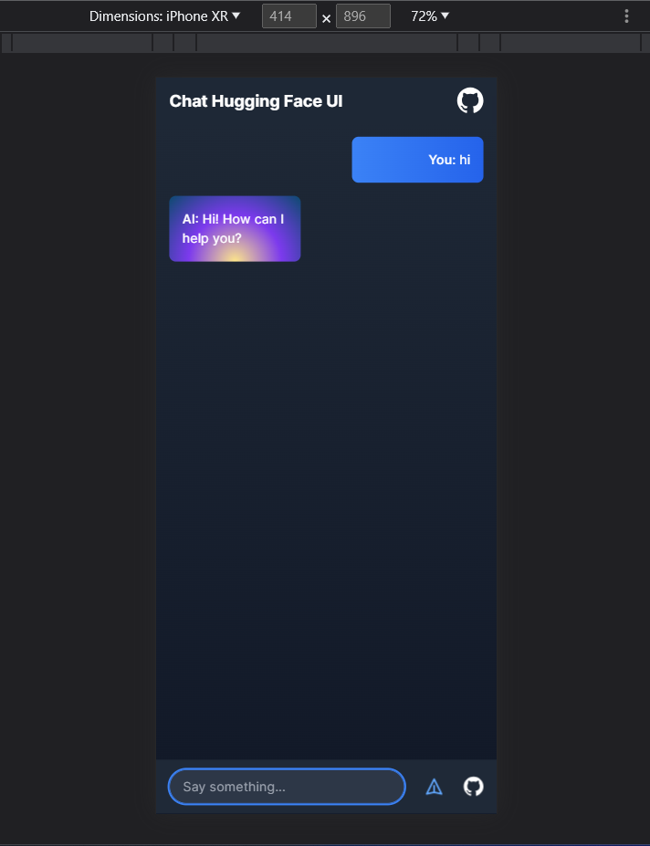

# **🚀 Hugging Face Chatbot 🤖**

  

    
    
    
  

  
Dieses Projekt ist eine Vorlage zum Erstellen eines Chatbots mit TypeScript und Next.js, der die Hugging Face API nutzt. Mit dieser Vorlage kannst du schnell einen Chatbot einrichten, der das Open Assistant SFT-4 12B Modell verwendet, um Fragen zu beantworten und Gespräche zu verschiedenen Themen zu führen.

  
  

    
  

   
  

    
  

## Eigene Instanz bereitstellen

Bereite das Beispiel mit [Vercel](https://vercel.com?utm_source=github&utm_medium=readme&utm_campaign=ai-sdk-example) vor:

## Beispiel Chatbot mit Hugging Face und Next.js

Willkommen bei einer einfachen Chatbot-Anwendung mit Hugging Face und Next.js. Diese Anwendung bietet eine grundlegende Benutzeroberfläche, um mit dem Open Assistant SFT-4 12B Modell zu interagieren. Mit nur wenigen Klicks kannst du mit einem fein abgestimmten englischen Sprachmodell chatten, das für Konversationen entwickelt wurde.

### Wichtige Funktionen:
- 🤖 Benutzerfreundliche Chat-Oberfläche
- 🚀 Schnell und reaktionsschnell
- 🤪 Spaß beim Chatten!

## Über Hugging Face

[Hugging Face](https://huggingface.co) ist ein Unternehmen, das Tools zur Erstellung von Anwendungen mithilfe von maschinellem Lernen entwickelt. Besonders bekannt ist es für seine 🤖 [Transformers](https://huggingface.co/docs/transformers/index) Python-Bibliothek für die Verarbeitung natürlicher Sprache und seine Plattform, die es Nutzern ermöglicht, Modelle und Datensätze des maschinellen Lernens zu teilen.

## Über Open Assistant

Das verwendete Modell in diesem Beispiel ist [Open Assistant SFT-4 12B](https://huggingface.co/OpenAssistant/oasst-sft-4-pythia-12b-epoch-3.5). Es handelt sich um das vierte englische Modell für betreutes Feintuning (SFT) des Open Assistant-Projekts, basierend auf einem Pythia 12B, das auf menschlichen Demonstrationen von Assistenten-Konversationen abgestimmt wurde, die über die [Open Assistant](https://open-assistant.io/) Plattform vor dem 25. März 2023 gesammelt wurden.

## Eigene Instanz bereitstellen

Um das Beispiel lokal auszuführen, musst du Folgendes tun:

1. Melde dich bei [Hugging Face](https://huggingface.co/join) an.
2. Gehe zu deinen [Hugging Face Konto-Einstellungen](https://huggingface.co/settings/tokens) und erstelle einen User Access Token mit `write`-Zugriff.
3. Setze die erforderliche Hugging Face Umgebungsvariable mit dem Token wie im [Beispiel für Umgebungsvariablen](./.env.local.example) gezeigt, jedoch in einer neuen Datei namens `.env.local`.
4. Klone das Repository: `git clone https://github.com/ElonMusk2002/chat-huggingface.git`
5. Installiere die erforderlichen Abhängigkeiten mit `npm install`.
6. Starte den Entwicklungsserver mit `npm dev`.

## 🛠️ Technologien

### Tech Stack

### Verwendete Tools

## 🤝 Beitrag leisten

Wenn du zu diesem Projekt beitragen möchtest, kannst du gerne einen [Pull Request](https://github.com/ElonMusk2002/chat-huggingface/pulls) oder ein [Issue](https://github.com/ElonMusk2002/chat-huggingface/issues) auf GitHub erstellen. Bevor du Änderungen vornimmst, beachte bitte die folgenden Richtlinien:

- Überprüfe, ob jemand bereits das gleiche Problem gemeldet oder die gleiche Verbesserung vorgeschlagen hat.
- Erstelle einen neuen Branch für deine Änderungen und verwende beschreibende Branch-Namen.
- Schreibe klare Commit-Nachrichten und füge deinem Code Kommentare hinzu.
- Stelle sicher, dass deine Änderungen richtig getestet sind.
- Aktualisiere die Dokumentation, falls erforderlich.

Vielen Dank für deinen Beitrag!